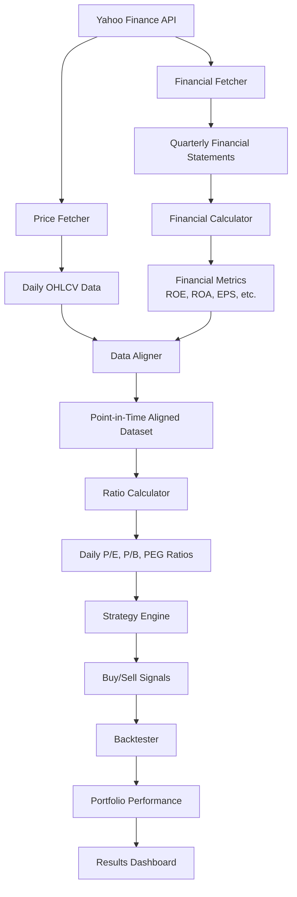
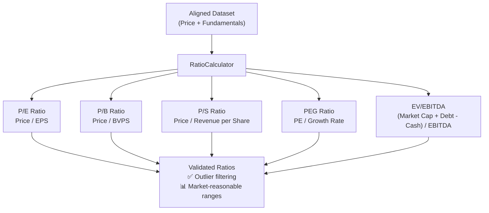
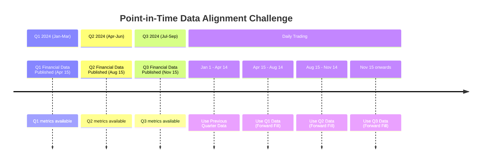
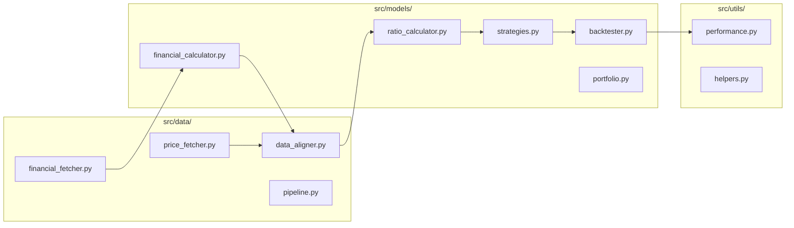
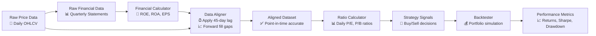

# Strategy Forge System Architecture

## 📊 High-Level Data Flow



## ⚙️ Ratio Calculator Implementation (Task 13 ✅)

The **RatioCalculator** transforms aligned fundamental data into daily trading ratios:



### Ratio Calculation Success Metrics (Apple AAPL Test):
- **P/E Ratio**: 56.7% coverage, median 37.68 (reasonable range)
- **P/B Ratio**: 20.6% coverage with automated outlier filtering  
- **P/S Ratio**: 56.7% coverage, median 9.68 (healthy range)
- **Validation**: Outliers outside 0-500 range filtered automatically
- **Integration**: Seamless with DataAligner pipeline output
```

## 🔄 Data Alignment Challenge (The Core Problem)



## 🏗️ Module Architecture



## 📈 Example: Data Transformation Pipeline

